# 🛡️ CodeMind MCP — AI Security Guardian

<p align="center">
<pre align="center">
   ___          _      __  __ _           _ 
  / __\___   __| | ___|  \/  (_)_ __   __| |
 / /  / _ \ / _` |/ _ \ |\/| | | '_ \ / _` |
/ /__| (_) | (_| |  __/ |  | | | | | | (_| |
\____/\___/ \__,_|\___|_|  |_|_|_| |_|\__,_|
</pre>
</p>

<p align="center">
  <strong>🛡️ Enterprise-Grade Security for AI-Generated Code</strong><br>
  <em>Think before ship.</em>
</p>

<p align="center">
  <a href="https://codemind-ai.github.io/codemind">📖 Documentation</a> •
  <a href="#installation">🚀 Quick Start</a> •
  <a href="#available-tools">🔧 Tools</a>
</p>

<p align="center">
  
  
  
  
  
</p>

---

## 🔥 What's New in v2.0

CodeMind v2.0 transforms from a simple code guardian into a **full security platform** rivaling Snyk, Semgrep, and CodeQL — while staying 100% open-source and privacy-first.

| Capability | Description | Status |
|-----------|-------------|--------|
| 🔍 **SAST** | 50+ vulnerability patterns (SQL injection, XSS, SSRF, etc.) | ✅ |
| 🔑 **Secrets Detection** | 30+ API key/token patterns + Shannon entropy analysis | ✅ NEW |
| 📦 **SCA** | Dependency CVE scanning via OSV.dev (12 lockfile formats) | ✅ NEW |
| 🏗️ **IaC Scanning** | Dockerfile, GitHub Actions, docker-compose security | ✅ NEW |
| 📋 **SARIF Reports** | Industry-standard output for GitHub Code Scanning & CI/CD | ✅ NEW |
| 📊 **Multi-Format Reports** | HTML, Markdown, JSON, CSV export | ✅ NEW |
| 🛡️ **Deep Scan** | Multi-layer analysis (SAST + Secrets + Quality) in one call | ✅ NEW |
| ✨ **AI Slop Detection** | Catches redundant comments, generic names, poor patterns | ✅ |

---

## ❌ Without CodeMind

AI coding assistants generate code fast, but without oversight. You get:

- ❌ **Security vulnerabilities** slipping through unnoticed
- ❌ **Hardcoded API keys** committed to version control
- ❌ **Vulnerable dependencies** with known CVEs
- ❌ **Insecure Dockerfiles** running as root with secrets in ENV
- ❌ **"AI slop"** — bloated, repetitive, low-quality code

## ✅ With CodeMind

CodeMind MCP acts as your resident security team. It reviews AI-generated code in real-time across **5 security dimensions** — before issues reach your codebase.

Add `use codemind` to your prompt:

```
Create a user authentication system with password hashing
and session management. use codemind
```

---

## 💬 Example Input / Output

### User Prompt:
```
Create a login endpoint with email/password using FastAPI 
and PostgreSQL. use codemind
```

### AI Response with CodeMind:

```python
from fastapi import FastAPI, HTTPException, Depends
from pydantic import BaseModel, EmailStr
from passlib.context import CryptContext
from sqlalchemy import text
import os

app = FastAPI()
pwd_context = CryptContext(schemes=["bcrypt"], deprecated="auto")

# ✅ Credentials from environment, not hardcoded
DATABASE_URL = os.environ.get("DATABASE_URL")
JWT_SECRET = os.environ.get("JWT_SECRET")

class LoginRequest(BaseModel):
    email: EmailStr  # ✅ Validated email format
    password: str

@app.post("/login")
async def login(request: LoginRequest, db = Depends(get_db)):
    # ✅ Parameterized query - no SQL injection
    query = text("SELECT * FROM users WHERE email = :email")
    user = await db.execute(query, {"email": request.email})
    
    if not user or not pwd_context.verify(request.password, user.hashed_password):
        # ✅ Generic error - doesn't reveal if email exists
        raise HTTPException(status_code=401, detail="Invalid credentials")
    
    return {"access_token": create_jwt_token(user.id)}
```

```
🛡️ Security Applied:
- Passwords hashed with bcrypt
- SQL uses parameterized queries (no injection)
- Credentials loaded from environment variables
- Generic error messages (no user enumeration)

📊 CodeMind Score: 95/100 (Grade: A) — ✅ PASSED

📋 Required environment variables:
- DATABASE_URL: PostgreSQL connection string
- JWT_SECRET: Secret key for JWT token signing
```

---

## 🚀 Installation

### Install via pip

```bash
# MCP Server (recommended - just works!)
pip install codemind

# With full CLI automation features
pip install codemind[cli]

# With AST analysis engine
pip install codemind[analysis]

# Everything
pip install codemind[all]
```


### Install in Cursor

Add to `.cursor/mcp.json`:

```json
{
  "mcpServers": {
    "codemind": {
      "command": "codemind",
      "args": ["serve"]
    }
  }
}
```

### Install in Claude Desktop

Add to your `claude_desktop_config.json`:

```json
{
  "mcpServers": {
    "codemind": {
      "command": "codemind",
      "args": ["serve"]
    }
  }
}
```

### Install in VS Code (Copilot)

Add to your MCP settings:

```json
{
  "mcpServers": {
    "codemind": {
      "command": "codemind",
      "args": ["serve"]
    }
  }
}
```

### Install in Windsurf

Add to your Windsurf MCP configuration:

```json
{
  "mcpServers": {
    "codemind": {
      "command": "codemind",
      "args": ["serve"]
    }
  }
}
```

---

## 🔧 Available Tools

CodeMind v2.0 exposes **14 MCP tools** that LLMs use automatically:

### 🔍 Static Analysis (SAST)

| Tool | Description |
|------|-------------|
| 🛡️ `guard_code` | Audit code for 50+ vulnerability patterns and quality issues |
| 🔒 `scan_and_fix` | Detect vulnerabilities and auto-fix them in one action |
| ✨ `improve_code` | AI-powered code improvement with Guardian verification |
| 🛡️ `deep_security_scan` | **Multi-layer scan**: SAST + Secrets + Quality in one call |

### 🔑 Secrets Detection

| Tool | Description |
|------|-------------|
| 🔑 `scan_secrets` | Detect 30+ API key/token types + Shannon entropy analysis |

### 📦 Software Composition Analysis (SCA)

| Tool | Description |
|------|-------------|
| 📦 `scan_dependencies` | Scan project lockfiles for CVEs via OSV.dev |
| 🔍 `check_package` | Check a single package version for known vulnerabilities |

### 🏗️ Infrastructure as Code (IaC)

| Tool | Description |
|------|-------------|
| 🏗️ `scan_iac_file` | Scan Dockerfile, GitHub Actions, or docker-compose |
| 🏗️ `scan_infrastructure` | Scan all IaC files in a project directory |

### 📋 Reporting & Export

| Tool | Description |
|------|-------------|
| 📋 `export_security_report` | Export as SARIF v2.1.0, HTML, Markdown, JSON, or CSV |

### 📖 Documentation & Workflow

| Tool | Description |
|------|-------------|
| 📖 `resolve_library` | Find library documentation IDs (like Context7) |
| 📖 `query_docs` | Fetch up-to-date library documentation and examples |
| 📊 `review_diff` | Generate AI review prompt for current git diff |
| 🛡️ `codemind` | Activate full Guardian workflow with `use codemind` |
| 📖 `best-practices` | **Resource**: Security & clean code reference guide |

---

## 🤖 AI Agent System Prompt

Add this system prompt to your AI agent to activate CodeMind automatically:

```markdown
## CodeMind Security Guardian

When writing or modifying code, ALWAYS follow this workflow:

1. **Fetch Documentation**: Before coding, use `query_docs()` to get current API docs
2. **Security First**: Never hardcode secrets, use parameterized queries, validate all input
3. **Deep Scan**: Run `deep_security_scan(code)` before presenting code to user
4. **Secrets Check**: Run `scan_secrets(code)` to verify no credentials leak
5. **Include Context**: Add security notes, env vars, and CodeMind score to your response

CRITICAL RULES:
- ❌ NEVER: password = "secret123" → ✅ ALWAYS: os.environ.get("PASSWORD")
- ❌ NEVER: f"SELECT * FROM users WHERE id = {id}" → ✅ ALWAYS: Parameterized queries
- ❌ NEVER: eval(user_input) → ✅ ALWAYS: Safe alternatives
- ❌ NEVER: Return code with security score < 80

When user says "use codemind", activate this full workflow automatically.
```

---

## 💡 Important Tips

### Add a Rule

To avoid typing `use codemind` in every prompt, add a rule to your MCP client:

- **Cursor**: Cursor Settings → Rules
- **Claude Code**: Add to `CLAUDE.md`
- **Or equivalent in your MCP client**

Example rule:

```
Always use CodeMind MCP to audit code for security vulnerabilities 
and clean code violations before generating or modifying code.
```

### Guardian Mode

Once connected, simply type in your chat:

> **You:** "use codemind"
>
> **AI:** "🛡️ Guardian Mode Activated! I've audited your code across 5 security dimensions. Here are the findings..."

---

## 🏗️ Architecture

```
┌──────────────────────────────────────────────────────┐
│                   CodeMind MCP v2.0                   │
├──────────┬──────────┬──────────┬──────────┬──────────┤
│   SAST   │ Secrets  │   SCA    │   IaC    │ Reports  │
│  50+     │  30+     │  12      │  Docker  │  SARIF   │
│ patterns │ patterns │ lockfile │  GHA     │  HTML    │
│ + quality│ + entropy│ formats  │  Compose │  MD/CSV  │
├──────────┴──────────┴──────────┴──────────┴──────────┤
│              Guardian Engine (Core)                   │
├──────────────────────────────────────────────────────┤
│          MCP Protocol (stdio / streamable-http)       │
├────────┬─────────┬──────────┬────────────┬───────────┤
│ Cursor │ Claude  │ VS Code  │  Windsurf  │  Any MCP  │
│        │ Desktop │ Copilot  │            │  Client   │
└────────┴─────────┴──────────┴────────────┴───────────┘
```

---

## 🆚 How CodeMind Compares

| Feature | CodeMind | Snyk | Semgrep | CodeQL |
|---------|----------|------|---------|--------|
| **Local-first** | ✅ 100% | ❌ Cloud | ⚠️ Partial | ⚠️ Partial |
| **Privacy** | ✅ No telemetry | ❌ Cloud scan | ⚠️ Optional | ⚠️ GitHub |
| **MCP Native** | ✅ Built-in | ❌ No | ❌ No | ❌ No |
| **SAST** | ✅ 50+ rules | ✅ | ✅ | ✅ |
| **Secrets** | ✅ 30+ patterns | ✅ | ✅ | ❌ |
| **SCA** | ✅ OSV.dev | ✅ | ⚠️ Limited | ❌ |
| **IaC** | ✅ Docker/GHA | ✅ | ⚠️ Limited | ❌ |
| **SARIF** | ✅ v2.1.0 | ✅ | ✅ | ✅ |
| **Auto-fix** | ✅ AI-powered | ✅ | ⚠️ Limited | ❌ |
| **Open Source** | ✅ MIT | ❌ Freemium | ⚠️ Partial | ✅ |
| **Price** | **Free** | $$$  | Freemium | Free |

---

## 🛠️ CLI & Git Integration

While the MCP server is the heart of CodeMind, we provide a CLI for local automation and git hooks.

### Install Git Hook

```bash
codemind install
```

### Git Workflow

CodeMind intercepts your `git push`, runs an AI review, and catches issues before they reach your team.

```bash
git push
# → CodeMind triggers and injects review into your IDE
```

### CLI Commands

| Command | Action |
|---------|--------|
| `codemind serve` | Start the MCP server |
| `codemind commit` | Generate AI commit messages (Conventional Commits) |
| `codemind pr create` | Generate AI PR descriptions |
| `codemind fix` | Apply suggested fixes locally |
| `codemind doctor` | Health check and setup wizard |

---

## 🔒 Privacy & Philosophy

- ✅ **100% Local**: All scanning happens on your machine — code never leaves.
- ✅ **Privacy-First**: No telemetry, no cloud, no API keys required for core features.
- ✅ **SCA Privacy**: Only package names/versions sent to OSV.dev — never source code.
- ✅ **Universal**: Works with Cursor, Claude Code, Windsurf, VS Code, and more.
- ✅ **User-Owned AI**: Leverages the AI assistant you're already using.

---

## 🎯 Who Is This For?

- **AI-Native Developers** — Who want enterprise-grade security on AI-generated code.
- **Privacy-Focused Teams** — Who need Snyk-level protection without cloud dependencies.
- **DevSecOps Engineers** — Who need SARIF reports for CI/CD pipeline integration.
- **"Vibe Coders"** — Who need structure and security without slowing down.

---

## 📖 More Documentation

- [Full Documentation](https://codemind-ai.github.io/codemind) — Comprehensive guides and API reference
- [Configuration Guide](https://codemind-ai.github.io/codemind/configuration) — Customize CodeMind for your workflow
- [Troubleshooting](https://codemind-ai.github.io/codemind/troubleshooting) — Common issues and solutions

---

## 🤝 Connect With Us

- 🌐 [Website](https://codemind-ai.github.io/codemind)
- 💻 [GitHub](https://github.com/codemind-ai/codemind)
- 🐛 [Issues](https://github.com/codemind-ai/codemind/issues)

---

## ⭐ Star History

If you find CodeMind useful, please consider giving us a star! ⭐

---

## 📄 License

MIT License — See [LICENSE](LICENSE) for details.

---

## 🗺️ Roadmap & Future Goals

```mermaid
graph TD
    A[✅ <b>v2.0 Released</b><br/>SAST+Secrets+SCA+IaC] -->|Next| B[🔬 <b>AST Engine</b><br/>tree-sitter analysis]
    B -->|Then| C[� <b>Taint Tracking</b><br/>Dataflow analysis]
    C -->|Then| D[🤖 <b>Agentic Workflows</b><br/>Auto-remediation]
    D -->|Goal| E[🦄 <b>Y Combinator</b>]

    style A fill:#22c55e,stroke:#22c55e,color:#fff
    style B fill:#1c1c22,stroke:#3B82F6
    style C fill:#1c1c22,stroke:#3B82F6
    style D fill:#1c1c22,stroke:#3B82F6
    style E fill:#1c1c22,stroke:#facc15,stroke-width:2px
```



### ✨ What's Next

1. **🔬 AST Engine**: `tree-sitter` integration for semantic code analysis beyond regex.
2. **🔄 Taint Tracking**: Source-to-sink dataflow analysis for complex vulnerability chains.
3. **� Custom Rules**: Semgrep-inspired YAML rule language for community-driven rules.
4. **🤖 Agentic Workflows**: Autonomous vulnerability detection → fix → verify loops.
5. **🦄 Y Combinator**: Scaling to protect every developer worldwide.

---

<p align="center">
  <strong>CodeMind v2.0</strong> — <em>Enterprise security. Open source. Privacy first.</em>
</p>

